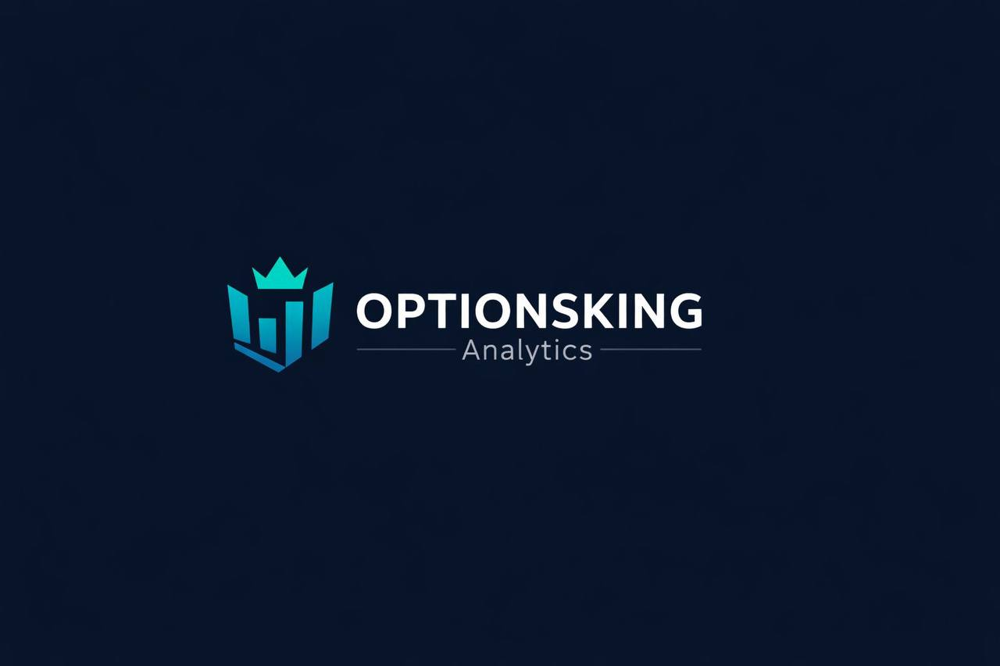

<p align="center">
  
</p>

<h1 align="center">OptionsKing Analytics v5.0</h1>

<p align="center">
  <strong>Real-time unusual options activity scanner &amp; analytics dashboard</strong><br/>
  Built with Streamlit · yfinance · Barchart OI · Plotly
</p>

<p align="center">
  <a href="https://optionsking.streamlit.app" target="_blank"></a>
</p>

---

## Features

| Tab | Description |
|---|---|
| **Live Scanning** | Real-time unusual options activity detection with yfinance + curl_cffi anti-ban (rotating browser profiles, exponential backoff). Configurable filters: min volume, OI, premium, delta. Threaded non-blocking scans. |
| **Open Interest** | Barchart OI integration with pagination (PAGE_SIZE=1000), HTTP 429 retry, automatic session renewal. Paginated AgGrid tables. |
| **Reports** | Automated DOCX report generation with separate buttons for Important Companies and Data Analysis. Full formatting with tables, colors, and professional layout. |
| **Data Analysis** | Top 20 by Volume, Top 20 by OI, Top 15 by Premium, breakdown by expiration for CALLs/PUTs. Continuous purchase cluster detection. |
| **Favorites** | Persistent favorites saved to JSON. Star/unstar any contract. Dedicated table view. |
| **Range** | Black-Scholes expected range calculator with visual Plotly gauge and support/resistance levels. |
| **Important Companies** | Projection analysis for consolidated + emerging market watchlists. PEG ratio, growth scores, comparative tables. Conditional expanders. |
| **News & Calendar** | RSS financial news with sentiment badges. Economic calendar from Investing.com + Yahoo + Fed events. |

## Architecture

```
optionsking/
+-- app_web.py                 # Streamlit entry point (main orchestrator)
+-- config/
|   +-- constants.py           # Numeric thresholds & global parameters
|   +-- watchlists.py          # WATCHLIST_EMPRESAS & WATCHLIST_EMERGENTES
|   +-- app_settings.py        # TAB_CONFIG, CALENDAR_CONFIG, EVENT_TYPES
+-- core/
|   +-- scanner.py             # yfinance scanning with curl_cffi anti-ban
|   +-- barchart_oi.py         # Barchart OI scraping with pagination & retry
|   +-- clusters.py            # Continuous purchase detection algorithm
|   +-- projections.py         # Company growth analysis (PEG, score)
|   +-- range_calc.py          # Black-Scholes expected range calculation
|   +-- news.py                # RSS feed aggregation & sentiment
|   +-- oi_tracker.py          # Open Interest change tracking
|   +-- economic_calendar.py   # Economic events (Investing/Yahoo/Fed)
+-- ui/
|   +-- styles.py              # CSS_STYLES (dark theme, zebra tables, badges)
|   +-- components.py          # 26 reusable UI components
|   +-- calendar_styles.py     # Calendar-specific CSS
|   +-- calendar_utils.py      # Calendar helper functions
|   +-- tabs/
|       +-- calendar_tab.py    # Extracted calendar tab renderer
+-- assets/
|   +-- Logo.png
|   +-- crown.svg
+-- .streamlit/config.toml     # Server + dark theme configuration
+-- .devcontainer/             # GitHub Codespaces support
+-- requirements.txt           # Pinned dependencies
+-- pyproject.toml             # black, ruff, mypy, pytest config
+-- .env.example               # Environment variable template
```

## Quick Start

### Local Development

```bash
# 1. Clone
git clone https://github.com/ArielDavid234/monitor-opciones.git
cd monitor-opciones

# 2. Virtual environment
python -m venv .venv
.venv/Scripts/activate        # Windows
# source .venv/bin/activate   # macOS/Linux

# 3. Install dependencies
pip install -r requirements.txt

# 4. Run
streamlit run app_web.py
```

### Streamlit Cloud

The app deploys automatically from the main branch.
Entry point: app_web.py | Python 3.11+

## Tech Stack

| Layer | Technology |
|---|---|
| Frontend | Streamlit 1.54+, Plotly, streamlit-aggrid |
| Data | yfinance, pandas, numpy, scipy |
| HTTP | curl_cffi (anti-ban), requests, BeautifulSoup4 |
| Reports | python-docx |
| News | feedparser (RSS) |

## Development

```bash
# Lint
pip install ruff black mypy
ruff check .
black --check .

# Format
black .
ruff check --fix .
```

Configuration for all tools is in pyproject.toml.

## License

MIT